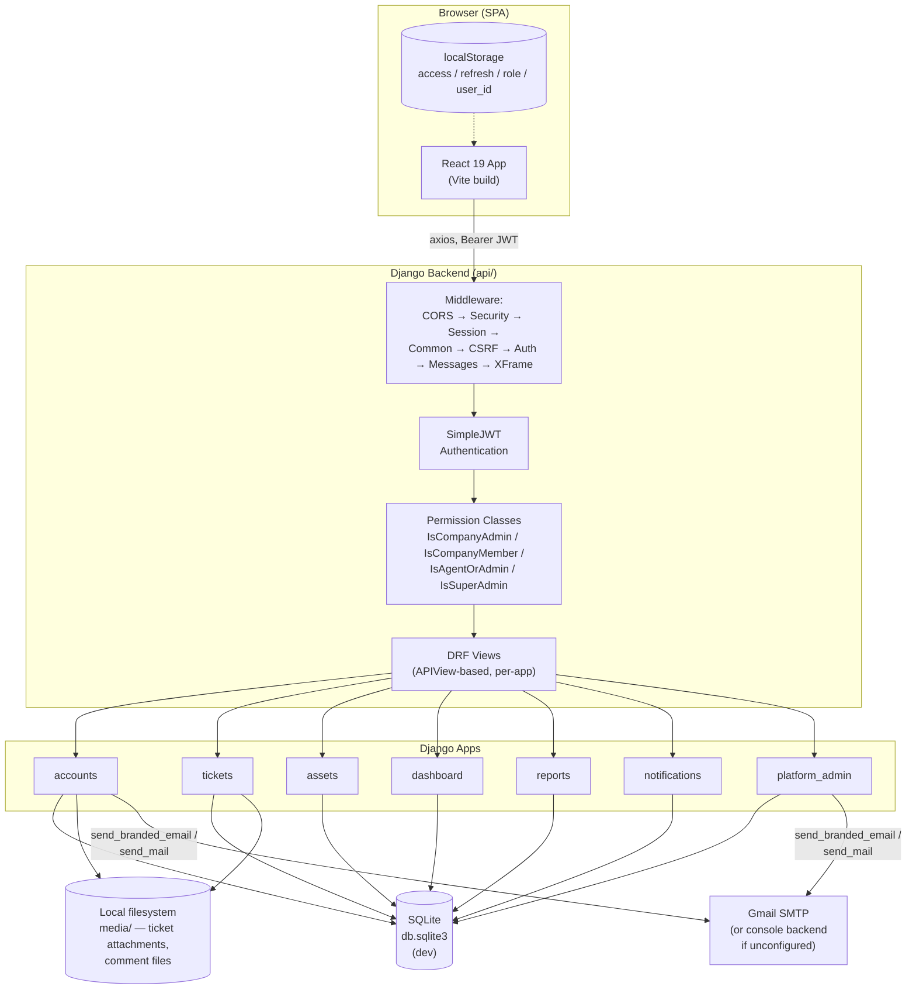
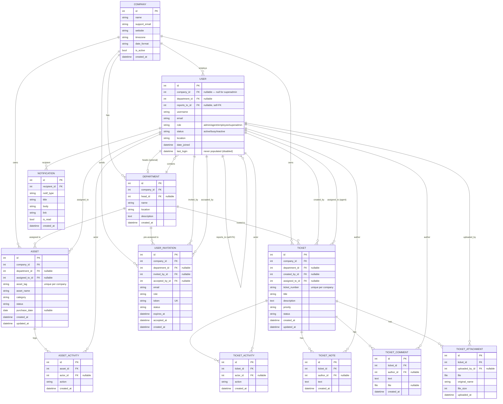
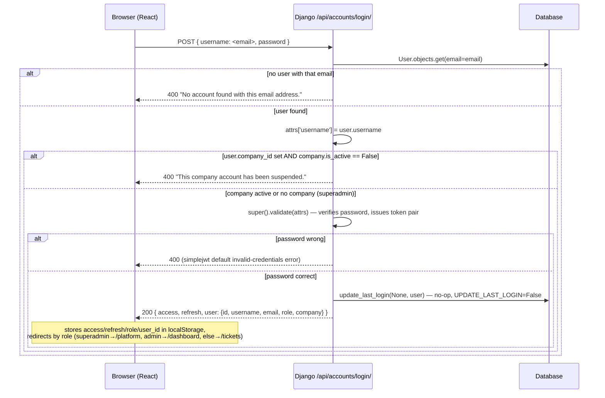
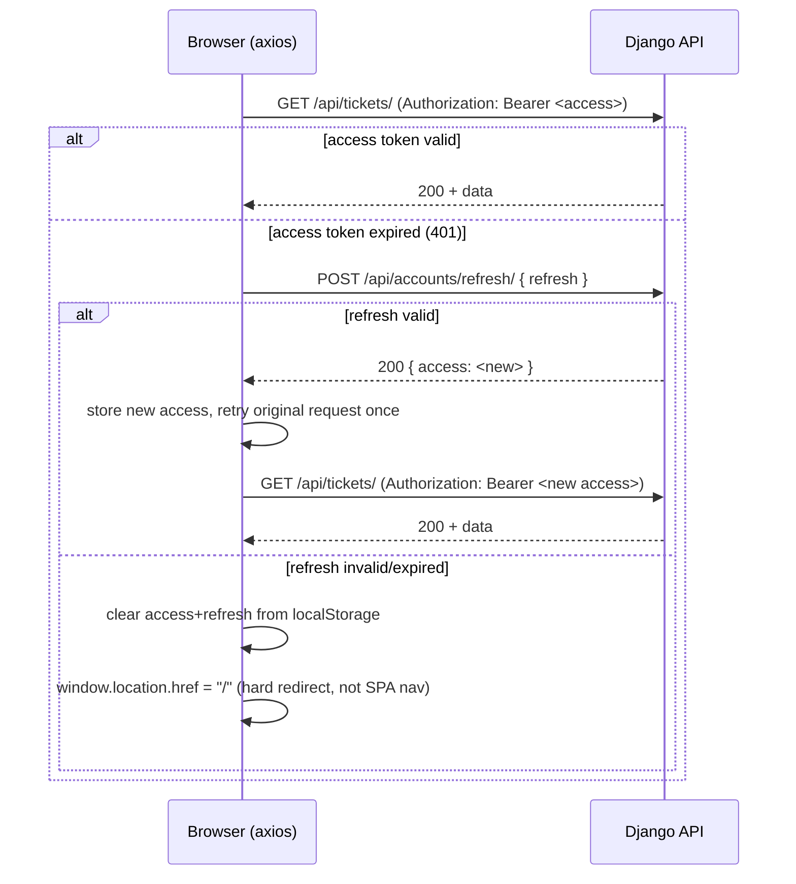
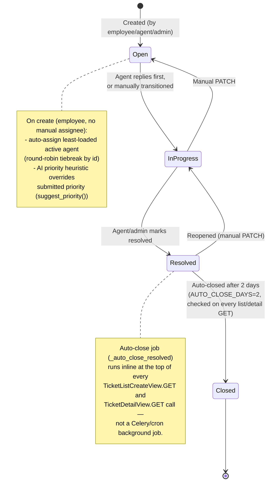
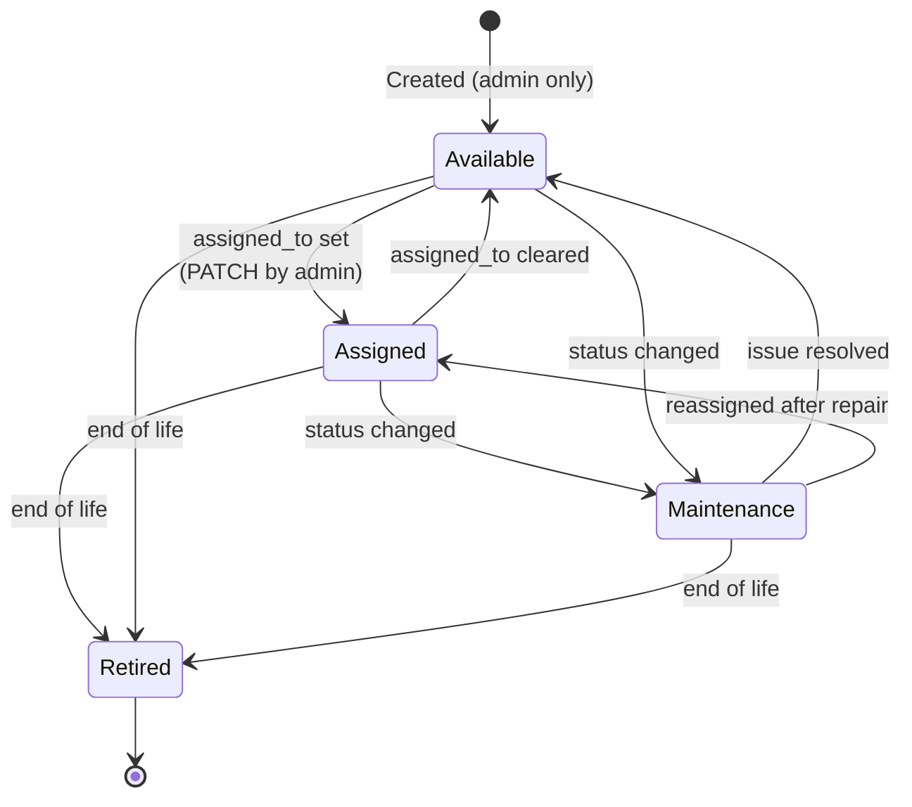

# TickDesk — Technical Knowledge Transfer Document

**Audience:** an incoming developer who needs to understand, run, and extend this codebase with no prior context.
**Scope:** this document describes the system **exactly as implemented in the current codebase** — including gaps, dead code, and known bugs — not an idealized or aspirational version of it. Where a feature *looks* real in the UI but has no backend behind it, that is called out explicitly.

---

## Table of Contents

1. [Project Overview](#1-project-overview)
2. [Problem Statement](#2-problem-statement)
3. [Objectives](#3-objectives)
4. [Complete System Architecture](#4-complete-system-architecture)
5. [Frontend Architecture (React)](#5-frontend-architecture-react)
6. [Backend Architecture (Django REST Framework)](#6-backend-architecture-django-rest-framework)
7. [Folder Structure](#7-folder-structure)
8. [Database Models and Relationships](#8-database-models-and-relationships)
9. [ER Diagram](#9-er-diagram)
10. [Authentication & Authorization Flow (JWT)](#10-authentication--authorization-flow-jwt)
11. [Complete API List](#11-complete-api-list)
12. [Major Modules and Features](#12-major-modules-and-features)
13. [Ticket Lifecycle Workflow](#13-ticket-lifecycle-workflow)
14. [Asset Management Workflow](#14-asset-management-workflow)
15. [User Role Permissions](#15-user-role-permissions)
16. [Technologies Used](#16-technologies-used)
17. [Third-Party Libraries](#17-third-party-libraries)
18. [Database Schema](#18-database-schema)
19. [Validation Logic](#19-validation-logic)
20. [Security Features (and Gaps)](#20-security-features-and-gaps)
21. [Deployment Architecture](#21-deployment-architecture)
22. [Challenges Solved During Development](#22-challenges-solved-during-development)
23. [Future Enhancements](#23-future-enhancements)
24. [Important Design Decisions](#24-important-design-decisions)
25. [Known Dead Code / Orphaned Files](#25-known-dead-code--orphaned-files)

---

## 1. Project Overview

**TickDesk** is a multi-tenant **IT Helpdesk & Asset Management** web application. A single deployment serves multiple independent companies ("tenants"), each with its own users, tickets, assets, and departments, fully isolated from every other company's data. On top of the per-company product, there is a **platform-level "Master Admin" console** (superadmin role) that oversees every registered company from one dashboard — company growth, per-company drill-down, cross-company reports, and platform-wide announcements.

The stack is a classic **decoupled SPA + REST API**:
- **Backend:** Django 6.0.6 + Django REST Framework, JWT-authenticated, SQLite in development.
- **Frontend:** React 19 (Vite-built SPA), React Router v7, plain `axios` for API calls — no Redux/Zustand/React Query; state is local `useState`/`useEffect` per page.

There is no server-side rendering, no GraphQL, no websockets — all "live" behavior (chat-style ticket comments, notification bell) is implemented via short-interval polling.

---

## 2. Problem Statement

Small-to-mid-size organizations running internal IT support typically end up duct-taping together a spreadsheet for asset tracking, an email inbox or generic ticketing tool for support requests, and no visibility into team workload or SLA performance. There is usually no single place where:

- An **employee** can raise an issue and see its status without pinging IT directly.
- A **support agent** can see their assigned queue, prioritize by real signal, and track their own resolution history.
- A **company admin** can see department-level workload, asset utilization, and delegate access safely (who can see what).
- A **platform operator** (in a SaaS/multi-company context) can see which customer companies are active, growing, or need attention — without manually querying each tenant's database.

TickDesk exists to unify **ticket management** and **IT asset management** under one role-aware application, with a platform-owner layer on top for anyone running it as a multi-tenant service.

---

## 3. Objectives

1. Provide a **ticket lifecycle system** (create → triage → assign → resolve → auto-close) with priority, department routing, file attachments, internal agent-only notes, and a customer-facing comment thread.
2. Provide an **asset inventory system** (create → assign → track status → retire) tied to users and departments, with an auto-numbered asset tag per company.
3. Enforce **strict multi-tenant data isolation** — every company's tickets, assets, users, and departments are invisible to every other company.
4. Support **four distinct roles** (Employee, Support Agent, Company Admin, Master Admin/Superadmin) each with a materially different UI and API permission surface, not just hidden buttons.
5. Give company admins **operational visibility**: dashboards, reports, department/user analytics, all computed from real data (not static mock numbers) — this was an explicit, repeatedly-enforced project rule during development (see [§24](#24-important-design-decisions)).
6. Give the platform owner (Master Admin) a **cross-tenant oversight console**: company registry, suspend/reactivate, admin password reset, platform-wide announcements, and CSV-exportable reports.
7. Keep the codebase honest — **no feature should look functional in the UI while being disconnected from a real backend**, and where that line was crossed during iterative AI-assisted development, it was later audited and either wired to a real endpoint or explicitly hidden/commented out (see [§25](#25-known-dead-code--orphaned-files)).

---

## 4. Complete System Architecture



**Request flow in one sentence:** the React SPA attaches a JWT access token to every request via an axios interceptor; Django's middleware stack runs CORS/security/session/CSRF/auth checks; DRF authenticates the token via `rest_framework_simplejwt`; a per-view `permission_classes` check (company-scoped role check) gates access; the view queries the ORM (always filtered by `request.user.company` except for `platform_admin`, which is intentionally cross-tenant) and returns JSON.

---

## 5. Frontend Architecture (React)

- **Build tool:** Vite 8. **React:** 19.2.7. **Routing:** `react-router-dom` v7 (`BrowserRouter`/`Routes`/`Route`).
- **No global state library.** No Redux, Zustand, Context API usage of note (the `context/` and `hooks/` and `routes/` and `utils/` directories exist under `frontend/src/` but are **empty** — scaffolded and never used).
- **API layer:** a single hand-rolled axios wrapper, `frontend/src/services/api.js`:
  - `axios.create({ baseURL: "http://127.0.0.1:8000/api/" })` — **hardcoded** local backend URL, not read from an env var (`import.meta.env`). This must change before any real deployment.
  - **Request interceptor:** reads `localStorage.getItem("access")`, sets `Authorization: Bearer <token>` if present.
  - **Response interceptor:** on a `401` that hasn't already been retried, it POSTs (via a raw `axios.post`, bypassing the interceptor chain) to the hardcoded `http://127.0.0.1:8000/api/accounts/refresh/` with the stored `refresh` token, stores the new `access` token, retries the original request once. If the refresh call itself fails, it clears `access`/`refresh` from localStorage and does a **hard redirect** (`window.location.href = "/"`), not a React Router navigation.
- **Auth/session storage:** plain `localStorage` keys — `access`, `refresh`, `role`, `user_id`. No httpOnly cookies, no in-memory-only token strategy. See [§20](#20-security-features-and-gaps) for the XSS implication.
- **Route guarding:** `frontend/src/components/common/ProtectedRoute.jsx` — a simple wrapper:
  ```jsx
  function ProtectedRoute({ children, roles }) {
      const token = localStorage.getItem("access");
      const role  = localStorage.getItem("role");
      if (!token) return <Navigate to="/login" replace />;
      if (roles && !roles.includes(role)) return <Navigate to="/tickets" replace />;
      return children;
  }
  ```
  This is a **UI-routing convenience only** — it does not validate the JWT's signature, expiry, or actually-assigned role against the server. The real authorization boundary is the backend's `permission_classes` on each endpoint. A user who edits `localStorage.role` in devtools can navigate to a gated page's UI shell, but every data-fetching API call on that page will 403 because the backend independently re-checks the caller's real role from the JWT-authenticated user record.
- **Layout shell:** `frontend/src/layouts/` wraps authenticated pages with `Sidebar` + `Navbar` (`AppLayout`).
- **Shared UI components** (`frontend/src/components/ui/`): `Card`, `Button`, `Input`, `StatusBadge`, `SummaryCard` (stat tile with sparkline), `Sparkline`, `AreaChart`, `Donut`, `ActionCard`, `TableCard` — small, dumb, reusable presentational components (mostly SVG chart primitives) used across Dashboard/Assets/Tickets/Users/Departments/Reports pages. **Note:** the platform-admin pages (`CompanyDetail.jsx` specifically) deliberately keep **local, self-contained copies** of `Sparkline`/`Donut`/`AreaChart`/`StatTile` rather than importing the shared versions — an explicit product decision (see [§24](#24-important-design-decisions)).
- **Icons:** `react-icons` (Feather icon set, `react-icons/fi`), used almost everywhere. `lucide-react` is also a dependency but not the primary icon set in use.
- **No CSS framework** (no Tailwind/Bootstrap/MUI) — every page has its own hand-written `.css` file with inline styles used liberally for one-off layout (especially in the platform-admin section).

---

## 6. Backend Architecture (Django REST Framework)

- **Django 6.0.6**, **DRF 3.17.1**, **djangorestframework_simplejwt 5.5.1**.
- **Apps** (all in `INSTALLED_APPS`, in this order): `accounts`, `tickets`, `assets`, `dashboard`, `reports`, `notifications`, `platform_admin`.
- **View style:** every endpoint is a class-based `APIView` subclass (no `ModelViewSet`/`GenericViewSet`/routers — one exception: `CompanySettingsView` uses `generics.RetrieveUpdateAPIView`). Business logic lives directly in `get`/`post`/`patch`/`delete` methods, not in serializers-as-the-source-of-truth or a service layer, **except** `dashboard/services.py`, which factors the company-admin dashboard's aggregation queries into standalone functions (`get_dashboard_stats`, `get_ticket_status_distribution`, `get_asset_distribution`, `get_recent_tickets`, `get_recent_assets`) called from thin `dashboard/views.py` views.
- **Permission model:** five permission classes total, each a simple `has_permission` boolean check (no `has_object_permission` anywhere in the codebase):
  - `IsCompanyMember` (`dashboard/permissions.py`) — any authenticated user with a `company_id`.
  - `IsAgentOrAdmin` (`dashboard/permissions.py`) — role in `{agent, admin}` and has a company.
  - `IsCompanyAdmin` (`dashboard/permissions.py`) — role `== 'admin'` and has a company.
  - `IsSuperAdmin` (`platform_admin/permissions.py`) — role `== 'superadmin'` (no company check — superadmin's `company` is always `None`).
  - DRF's built-in `IsAuthenticated` — used for `profile`, `change_password`, and all of `notifications` (these don't need company scoping since they're always self-scoped to `request.user`).
  - **Important gap:** several endpoints declare a broader class-level permission but do an *additional, undocumented, in-method role check* that isn't visible from the URL/permission_classes alone — e.g. `DepartmentListCreateView.post`, `UserListView.post`, `AssetListCreateView.post`/`AssetDetailView.patch`/`.delete` all require `role == 'admin'` manually inside the method body even though the class only declares `IsCompanyMember`. A developer auditing permissions must read every view body, not just `permission_classes`.
- **Tenant isolation pattern:** nearly every queryset is manually filtered by `.filter(company=request.user.company)` inside the view — there is no Django-level "current tenant" middleware, no row-level security at the DB layer, and no `PROTECT` on any FK (see [§8](#8-database-models-and-relationships)). `platform_admin` is the one app that deliberately queries **across** all companies (by design — it's the platform-owner console).
- **Aggregation/analytics pattern (reused everywhere):** stat tiles across Dashboard, Assets, Tickets, Users, Departments, Reports, and Platform all follow the same hand-rolled convention:
  - `_delta(qs)` → `"+N vs last month"` string, computed from a real 30-day-window count (`created_at__gte=now-30d` or `date_joined__gte=...`), or `"steady"` if zero.
  - `_cumulative_trend(qs, ...)` (for monotonically-growing counts like total users/companies) or `_per_month_trend(qs, ...)` (for mutable-status counts like open tickets, where true historical state can't be reconstructed) → a 6-point sparkline array over the trailing 6 calendar months.
  - This exact helper pattern (`_last_6_month_starts`, `_cumulative_trend`/`_per_month_trend`, `_delta`) is **duplicated inline in five separate files** (`dashboard/services.py`, `assets/views.py`, `tickets/views.py`, `accounts/user_views.py`, `accounts/dept_views.py`, `reports/views.py`, `platform_admin/views.py`) rather than factored into one shared utility module — a deliberate choice at the time (see [§24](#24-important-design-decisions)) to avoid premature abstraction before the pattern had proven itself 3+ times, but it is now duplicated well past that threshold and is a strong candidate for extraction into a shared `trends.py`-style helper.

---

## 7. Folder Structure

### Backend (`backend/`)

```
backend/
├── manage.py
├── db.sqlite3                  # dev database (gitignored)
├── requirements.txt             # UTF-16 LE encoded (historical accident — preserve encoding if editing)
├── .env                         # gitignored — EMAIL_HOST_USER, EMAIL_HOST_PASSWORD, DEFAULT_FROM_EMAIL, PLATFORM_NOTIFY_EMAIL
├── venv/                        # gitignored virtualenv
├── media/                       # uploaded files (gitignored contents, dir tracked)
│   ├── ticket_attachments/<ticket_number>/
│   └── comment_files/
├── config/                      # Django project package
│   ├── settings.py
│   ├── urls.py                  # top-level URL router, mounts every app under /api/<app>/
│   ├── wsgi.py / asgi.py
├── accounts/                     # users, companies, departments, invitations, auth, profile
│   ├── models.py                 # Company, User, Department, UserInvitation
│   ├── views.py                  # login/profile/change-password/company settings
│   ├── user_views.py              # user CRUD, invites, register, new-company email+notify
│   ├── dept_views.py               # department CRUD + analytics
│   ├── serializers.py              # CompanySerializer, DepartmentListSerializer, DepartmentDetailSerializer
│   ├── email_utils.py              # shared branded HTML email builder
│   ├── email_assets/logo.png        # inline email logo (120×120, resized once via a temporary Pillow install)
│   ├── management/commands/create_superadmin.py   # CLI to provision a Master Admin account
│   └── urls.py
├── tickets/                      # ticket lifecycle, attachments, comments, notes, activity
│   ├── models.py                  # Ticket, TicketAttachment, TicketComment, TicketNote, TicketActivity
│   ├── views.py                    # all ticket endpoints + suggest_priority() heuristic + auto-close job
│   └── urls.py
├── assets/                       # IT asset inventory
│   ├── models.py                  # Asset, AssetActivity
│   ├── views.py
│   └── urls.py
├── dashboard/                    # company-admin dashboard aggregation (no models)
│   ├── permissions.py              # IsCompanyAdmin / IsCompanyMember / IsAgentOrAdmin
│   ├── services.py                  # aggregation query functions
│   ├── serializers.py                # RecentTicketSerializer, RecentAssetSerializer
│   ├── views.py
│   └── urls.py
├── reports/                      # company-admin analytics/reports (no models — reads tickets/assets/accounts)
│   ├── views.py
│   └── urls.py
├── notifications/                # in-app bell notifications
│   ├── models.py                  # Notification
│   ├── utils.py                    # notify(recipient, type, title, body, link) helper
│   ├── views.py
│   └── urls.py
└── platform_admin/               # Master Admin (superadmin) cross-tenant console — no models of its own
    ├── permissions.py               # IsSuperAdmin
    ├── views.py                      # companies, dashboard, announcements, reports, reset-password
    └── urls.py
```

### Frontend (`frontend/src/`)

```
frontend/src/
├── main.jsx
├── App.jsx                       # all route definitions live here
├── services/
│   └── api.js                     # axios instance + interceptors (token attach + refresh)
├── components/
│   ├── common/ProtectedRoute.jsx
│   ├── layout/{Sidebar,Navbar}.jsx  # role-filtered nav + top bar (search, notifications, profile menu)
│   └── ui/                          # Card, Button, Input, StatusBadge, SummaryCard, Sparkline, AreaChart, Donut, ActionCard, TableCard
├── layouts/                       # AppLayout (Sidebar+Navbar+<Outlet/> shell)
├── pages/
│   ├── landing/Landing.jsx          # public marketing page ("/") — has real product screenshots
│   ├── auth/{Login,Register,AcceptInvite}.jsx
│   ├── dashboard/Dashboard.jsx        # admin/agent dashboard
│   ├── tickets/{Tickets,TicketDetail}.jsx
│   ├── assets/{Assets,AssetDetail}.jsx
│   ├── users/Users.jsx
│   ├── departments/Departments.jsx
│   ├── reports/Reports.jsx            # company-admin reports (distinct from pages/platform/Reports.jsx)
│   ├── knowledge-base/KnowledgeBase.jsx   # ⚠ fully static/fake, no backend
│   ├── profile/Profile.jsx
│   ├── settings/                       # General.jsx (real) + AccessSecurity.jsx (partially real) + 3 hidden dead-code mockups
│   ├── platform/                       # Master Admin section
│   │   ├── PlatformDashboard.jsx        # routed at /platform
│   │   ├── Platform.jsx                  # routed at /platform/companies
│   │   ├── CompanyDetail.jsx
│   │   ├── Announcements.jsx
│   │   └── Reports.jsx                   # platform-wide CSV/print reports
│   ├── agent/AgentPortal.jsx           # ⚠ orphaned — not routed anywhere
│   └── employee/EmployeePortal.jsx     # ⚠ orphaned — not routed anywhere
├── assets/                         # images, logos, screenshots (screenshots/ added for the landing page)
├── context/                        # empty, unused
├── hooks/                          # empty, unused
├── routes/                         # empty, unused
├── utils/                          # empty, unused
└── styles/
```

---

## 8. Database Models and Relationships

Every model below is exactly as defined in the codebase (verified by direct file reads), including quirks.

### `accounts` app

**`Company`**
| Field | Type | Notes |
|---|---|---|
| `name` | `CharField(max_length=255)` | |
| `support_email` | `EmailField(blank=True)` | |
| `website` | `URLField(blank=True)` | |
| `timezone` | `CharField(max_length=50, default="GMT+0")` | |
| `date_format` | `CharField(max_length=20, default="MM/DD/YYYY")` | |
| `is_active` | `BooleanField(default=True)` | drives login-blocking when a company is suspended |
| `created_at` | `DateTimeField(auto_now_add=True)` | |

`Meta.verbose_name_plural = "Companies"`. `__str__` → company name.

**`User`** (extends `AbstractUser`, set as `AUTH_USER_MODEL`)
| Field | Type | Notes |
|---|---|---|
| `company` | `FK(Company, CASCADE, null=True, blank=True, related_name='users')` | **nullable** — `null` for superadmin only |
| `department` | `FK(Department, SET_NULL, null=True, blank=True, related_name='users')` | |
| `role` | `CharField(choices, default='employee')` | `admin` / `agent` / `employee` / `superadmin` |
| `status` | `CharField(choices, default='active')` | `active` / `busy` / `inactive` |
| `location` | `CharField(max_length=100, blank=True)` | |
| `reports_to` | `FK('self', SET_NULL, null=True, blank=True, related_name='subordinates')` | manager hierarchy, not used in any current view logic beyond storage/display |

Plus all inherited `AbstractUser` fields (`username`, `first_name`, `last_name`, `email`, `password`, `is_staff`, `is_superuser`, `date_joined`, `last_login`, ...). **`last_login` is never populated** because `SIMPLE_JWT["UPDATE_LAST_LOGIN"] = False` — this field is effectively dead despite being queried/displayed in a couple of places (e.g. invite "has logged in" indicator).

**`Department`**
| Field | Type |
|---|---|
| `company` | `FK(Company, CASCADE, related_name='departments')` |
| `name` | `CharField(max_length=255)` |
| `head` | `FK(User, SET_NULL, null=True, blank=True, related_name='headed_departments')` |
| `location` | `CharField(max_length=100, blank=True)` |
| `description` | `TextField(blank=True)` |
| `created_at` | `DateTimeField(auto_now_add=True)` |

**`UserInvitation`**
| Field | Type |
|---|---|
| `company` | `FK(Company, CASCADE, related_name='user_invitations')` |
| `email` | `EmailField()` |
| `role` | `CharField(choices=User.ROLE_CHOICES, default='employee')` |
| `department` | `FK(Department, SET_NULL, null=True, blank=True)` |
| `location` | `CharField(max_length=100, blank=True)` |
| `invited_by` | `FK(User, SET_NULL, null=True, blank=True, related_name='sent_user_invitations')` |
| `token` | `CharField(max_length=96, unique=True, editable=False)` — auto-generated |
| `status` | `pending` / `accepted` / `expired` / `cancelled` |
| `expires_at` | `DateTimeField()` — auto-defaulted |
| `accepted_by` | `FK(User, SET_NULL, null=True, blank=True)` |
| `accepted_at` | `DateTimeField(null=True, blank=True)` |
| `created_at` | `DateTimeField(auto_now_add=True)` |

`Meta`: `ordering=['-created_at']`, indexes on `(company, email, status)` and `(token)`. Custom `save()`: auto-generates `token = secrets.token_urlsafe(48)` and `expires_at = now() + 7 days` on first save if not already set. `@property is_expired` → `now() >= expires_at`.

### `tickets` app

**`Ticket`**
| Field | Type |
|---|---|
| `company` | `FK(Company, CASCADE, related_name='tickets')` |
| `ticket_number` | `CharField(max_length=20, editable=False)` — **not globally unique**, see below |
| `title` | `CharField(max_length=500)` |
| `description` | `TextField(blank=True)` |
| `priority` | `low` / `medium` / `high` / `critical` |
| `status` | `open` / `in_progress` / `resolved` / `closed` |
| `created_by` | `FK(User, SET_NULL, null=True, related_name='created_tickets')` |
| `assigned_to` | `FK(User, SET_NULL, null=True, blank=True, related_name='assigned_tickets')` |
| `department` | `FK(Department, SET_NULL, null=True, blank=True)` |
| `created_at` / `updated_at` | auto timestamps |

`Meta`: `ordering=['-created_at']`, **`unique_together = [['company', 'ticket_number']]`** (per-company uniqueness — see [§22](#22-challenges-solved-during-development) for the bug this fixed). Custom `save()`:
```python
if not self.ticket_number:
    year  = datetime.date.today().year
    count = Ticket.objects.filter(company=self.company).count() + 1
    self.ticket_number = f"TKT-{year}-{count:04d}"
```
⚠️ **Known risk:** this is a count-based generator, not an atomic DB sequence. Under concurrent creation (two requests reading the same count before either saves) or after row deletion (count no longer matches the true historical max), it can theoretically produce a duplicate `ticket_number` within the same company, which would now raise an `IntegrityError` on the `unique_together` constraint instead of silently colliding across companies (the original bug). This is a real remaining fragility, not fully eliminated, just scoped down to a per-company (much lower probability) race window.

**`TicketAttachment`**: `ticket` (FK Ticket, CASCADE), `file` (upload path `ticket_attachments/<ticket_number>/<filename>`), `original_name`, `file_size`, `uploaded_by` (FK User, SET_NULL), `uploaded_at`.

**`TicketComment`**: `ticket` (FK, CASCADE), `author` (FK User, SET_NULL), `text` (blank ok), `file` (optional, uploads to `comment_files/`), `original_name`, `created_at`. This is the customer-facing chat thread.

**`TicketNote`**: `ticket` (FK, CASCADE), `author` (FK User, SET_NULL), `text` (required), `created_at`. Internal-only (agent/admin), not visible to the requester.

**`TicketActivity`**: `ticket` (FK, CASCADE), `actor` (FK User, SET_NULL), `action` (free text, max 500), `created_at`. The audit trail — every status/assignment/attachment/note event appends a row here.

### `assets` app

**`Asset`**
| Field | Type |
|---|---|
| `company` | `FK(Company, CASCADE, related_name='assets')` |
| `asset_tag` | `CharField(max_length=50)` — auto `AST-<year>-<0001>`, unique per company (same pattern/risk as `Ticket.ticket_number`) |
| `asset_name` | `CharField(max_length=255)` |
| `category` | `laptop` / `desktop` / `printer` / `monitor` / `networking` / `server` / `other` |
| `status` | `available` / `assigned` / `maintenance` / `retired` |
| `assigned_to` | `FK(User, SET_NULL, null=True, blank=True, related_name='assigned_assets')` |
| `department` | `FK(Department, SET_NULL, null=True, blank=True)` |
| `purchase_date` | `DateField(null=True, blank=True)` |
| `created_at` / `updated_at` | auto |

`Meta`: `unique_together=[['company','asset_tag']]`, `ordering=['-created_at']`.

**`AssetActivity`**: `asset` (FK, CASCADE), `actor` (FK User, SET_NULL), `action`, `created_at`. Audit trail for assignment/status changes.

### `notifications` app

**`Notification`**: `recipient` (FK User, **CASCADE**), `notif_type` (plain `CharField(max_length=40)` — **class constants exist but are not enforced via `choices=`**, so any string is technically valid at the model layer), `title`, `body` (blank ok), `link` (blank ok, a relative frontend path like `/tickets/42`), `is_read` (default `False`), `created_at`. `Meta.ordering=['-created_at']`.

### Apps with no models
- **`dashboard`** — no `models.py` at all; pure aggregation layer over `tickets`/`assets`/`accounts` tables.
- **`reports`** — `models.py` exists but is the untouched Django stub; zero models defined.
- **`platform_admin`** — no `models.py`; operates entirely on `accounts`/`tickets`/`assets` models across all companies.

### `on_delete` summary
- **`CASCADE`** used for: every `company` FK on `User`/`Department`/`UserInvitation`/`Ticket`/`Asset`; every child-record FK back to its parent record (`TicketAttachment.ticket`, `TicketComment.ticket`, `TicketNote.ticket`, `TicketActivity.ticket`, `AssetActivity.asset`); and `Notification.recipient`.
- **`SET_NULL`** used for every "who did this" / "who is this assigned to" style FK (16 relationships total) — deleting a `User` never cascades away tickets/assets/departments, it just nulls the reference.
- **`PROTECT` is used nowhere in the entire codebase.** This means deleting a `Company` row cascades destructively through *all* of its users, departments, invitations, tickets (and every ticket's attachments/comments/notes/activity), and assets (and their activity) — there is no safety guard. There is currently no UI path that actually deletes a `Company`, but this is a real landmine if one is ever added.

---

## 9. ER Diagram



---

## 10. Authentication & Authorization Flow (JWT)

**Library:** `djangorestframework_simplejwt`. **Token lifetimes:** access = 8 hours, refresh = 1 day. `ROTATE_REFRESH_TOKENS = False`, `BLACKLIST_AFTER_ROTATION = False`, `UPDATE_LAST_LOGIN = False`.

### Login sequence



Key file: `accounts/views.py`, `CustomTokenObtainPairSerializer.validate()`. This subclasses SimpleJWT's `TokenObtainPairSerializer` and does two things before delegating to the parent: (1) resolves the submitted "username" field as an **email** lookup and swaps in the real Django `username` so the parent validator can proceed normally, and (2) blocks login entirely if the resolved user's company has been suspended (`is_active=False`).

⚠️ **Timing/enumeration note:** the suspended-company check and the "no account found" check both happen **before** password verification. This means an unauthenticated caller can distinguish "no such email" vs "email exists but company suspended" vs "email exists, company fine" without ever supplying a correct password — a minor information-disclosure/user-enumeration gap.

### Authenticated request + silent refresh



### Authorization (per-request)
1. `JWTAuthentication` (DRF) decodes the bearer token and attaches `request.user` (a real `User` instance, looked up by the token's `user_id` claim).
2. The view's `permission_classes` (e.g. `IsCompanyAdmin`) runs `has_permission(request, view)`, checking `request.user.role` and `request.user.company_id`.
3. Inside the view body, querysets are manually filtered by `request.user.company` (tenant isolation) and, for several endpoints, an additional manual `role == 'admin'` check gates mutating actions (see [§6](#6-backend-architecture-django-rest-framework)).

No refresh-token blacklisting, no token revocation on logout (logout is purely a frontend `localStorage.removeItem` — a stolen, unexpired access token remains valid until it naturally expires, up to 8 hours).

---

## 11. Complete API List

**51 distinct URL patterns** across 7 routers, mounted under these prefixes in `backend/config/urls.py`: `/api/accounts/`, `/api/dashboard/`, `/api/assets/`, `/api/tickets/`, `/api/reports/`, `/api/notifications/`, `/api/platform/` (plus `/admin/` and media serving, not listed).

**Permission legend:** `Public` = `permission_classes = []` · `Auth` = `IsAuthenticated` · `Member` = `IsCompanyMember` · `Agent+` = `IsAgentOrAdmin` · `Admin` = `IsCompanyAdmin` · `Super` = `IsSuperAdmin`.

### `accounts` (prefix `/api/accounts/`)

| Endpoint | Method | Permission | Purpose |
|---|---|---|---|
| `register/` | POST | Public | Self-service signup — creates `Company` + first admin `User`, emails the platform owner + notifies all superadmins in-app. |
| `login/` | POST | Public | JWT login (email-based, see §10). |
| `refresh/` | POST | Public | SimpleJWT token refresh. |
| `profile/` | GET, PATCH | Auth | View/update own name + email. |
| `profile/change-password/` | POST | Auth | Change own password (validates current password + Django password rules). |
| `company/` | GET, PATCH | Admin | View/update own company settings (name, support email, website, timezone). |
| `departments/` | GET, POST | Member (POST additionally requires role=admin, manual 403 otherwise) | List (paginated/searchable) / create departments. |
| `departments/stats/` | GET | Admin | Stat tiles: total departments/employees, active departments, open tickets, with delta+trend. |
| `departments/employee-dist/` | GET | Admin | Top-5 departments by headcount %. |
| `departments/ticket-load/` | GET | Admin | Open tickets split general vs critical/high. |
| `departments/top-performing/` | GET | Admin | Top-3 departments leaderboard (lowest load, most staff). |
| `departments/<pk>/` | GET, PATCH, DELETE | Admin | Single department detail/update/delete. |
| `users/` | GET, POST | Member (role-filtered results; POST requires role=admin) | List/create users. Agents see only admins; employees see none via this endpoint. |
| `users/invite/` | POST | Admin | Create + email a single invitation. |
| `users/invite/bulk/` | POST | Admin | Create + email up to 200 invitations from a batch payload. |
| `users/invitations/` | GET | Admin | List sent invitations (paginated/searchable/status-filterable). |
| `users/invite/<token>/accept/` | GET, POST | Public (token is the auth) | Validate an invite / complete signup from it. |
| `users/stats/` | GET | Admin | Stat tiles: total/active users, agents, admins, with delta+trend. |
| `users/role-breakdown/` | GET | Admin | Counts/% by role. |
| `users/dept-distribution/` | GET | Admin | Top-6 departments by user count. |
| `users/<pk>/` | GET, PATCH | Admin | Single user detail (+ assigned assets) / update. |

### `dashboard` (prefix `/api/dashboard/`) — all GET, all `Admin`

| Endpoint | Purpose |
|---|---|
| `stats/` | Top-level admin dashboard KPIs. |
| `ticket-status/` | Ticket status distribution. |
| `asset-distribution/` | Asset category distribution. |
| `recent-tickets/` | Most recent tickets. |
| `recent-assets/` | Most recently added assets. |
| `dept-ticket-distribution/` | Per-department ticket counts by status (top 8). |
| `dept-asset-distribution/` | Per-department asset counts (top 8). |

### `assets` (prefix `/api/assets/`)

| Endpoint | Method | Permission | Purpose |
|---|---|---|---|
| `` (root) | GET, POST | Member (POST requires role=admin) | List (filterable by category/department/status/`my_assets`) / create assets — logs `AssetActivity`, notifies assignee. |
| `stats/` | GET | Member | Stat tiles: total/assigned/available/maintenance, with delta+trend. |
| `distribution/` | GET | Member | Asset counts/% by category. |
| `<pk>/` | GET, PATCH, DELETE | Member (mutations require role=admin) | Detail / update (logs reassignment/status changes, notifies) / delete. |
| `activity/` | GET | Member | 20 most recent asset activity entries, company-wide. |

### `tickets` (prefix `/api/tickets/`) — all `Member` unless noted

| Endpoint | Method | Purpose |
|---|---|---|
| `` (root) | GET, POST | Role-scoped list (employee=own, agent=assigned+own, admin=all); auto-closes stale resolved tickets first. POST auto-assigns least-loaded agent + AI-suggests priority for employee-created tickets. |
| `stats/` | GET | Role-scoped count tiles (total/open/in_progress/resolved/closed) with delta+trend. |
| `priority-distribution/` | GET | Role-scoped counts/% by priority. |
| `<pk>/` | GET, PATCH, DELETE | Detail (auto-closes first) / update (logs+notifies on status/assignment/priority change) / delete. |
| `<pk>/attachments/` | GET, POST | List / upload attachment (≤50MB, extension allowlist — see §19 for a message-text bug here). |
| `<pk>/attachments/<att_pk>/` | DELETE | **Admin** | Delete a specific attachment. |
| `<pk>/comments/` | GET, POST | List / post chat comment (≤10MB file); notifies counterpart; auto-transitions Open→In Progress on first agent reply. |
| `<pk>/activities/` | GET | Full audit-log timeline for the ticket. |
| `<pk>/notes/` | GET, POST | **Agent+** | Internal-only notes; notifies assigned agent. |
| `suggest-priority/` | POST | Runs the keyword heuristic (`suggest_priority()`) against a title/description. |

### `reports` (prefix `/api/reports/`) — all GET, all `Agent+`, role-scoped (agents see only their own assigned tickets/assets)

| Endpoint | Purpose |
|---|---|
| `summary/` | KPI summary: total tickets, assets managed, active users (admin only), SLA compliance %, asset utilization %. |
| `ticket-trends/` | Daily creation vs resolution, trailing 7 days. |
| `tickets-by-status/` | Counts/% by status. |
| `tickets-by-dept/` | Top-8 departments by ticket count. |
| `assets-by-category/` | Counts/% by category. |
| `top-agents/` | Top-5 agents by resolved/closed count. |
| `system-health/` | Resolution rate, asset utilization, and a **hardcoded** 99.9% "SLA uptime" figure. |

### `notifications` (prefix `/api/notifications/`) — all `Auth`

| Endpoint | Method | Purpose |
|---|---|---|
| `` (root) | GET | Caller's 30 most recent notifications + unread count. |
| `<pk>/read/` | PATCH | Mark one notification read. |
| `mark-all-read/` | POST | Mark all unread as read. |

### `platform_admin` (prefix `/api/platform/`) — all `Super`, cross-tenant

| Endpoint | Method | Purpose |
|---|---|---|
| `dashboard/` | GET | Platform-wide KPIs, 6-month trends, company growth chart, recent registrations, size-band buckets. |
| `companies/` | GET | List every company (admin, user/ticket counts, registration date, active status). |
| `companies/<pk>/` | GET, PATCH | Deep company profile (users/departments/assets/tickets/activity) / update `is_active` + company fields. |
| `companies/<pk>/reset-password/` | POST | Generate + email a new temp password to the company's primary admin. |
| `announcements/` | GET, POST | GET: company picker list. POST: email a subject/message to one company's admins or all admins platform-wide. |
| `reports/companies/` | GET | Cross-company export row per company. |
| `reports/users/` | GET | Cross-company export row per user. |
| `reports/tickets/` | GET | Cross-company export row per ticket. |
| `reports/assets/` | GET | Cross-company export row per asset. |

---

## 12. Major Modules and Features

| Module | Real/Wired | Notes |
|---|---|---|
| **Ticket management** | ✅ Real | Full lifecycle, attachments, chat comments, internal notes, activity log, auto-assign, AI-priority-suggestion, auto-close. |
| **Asset management** | ✅ Real | Inventory, assignment, status tracking, activity log, per-company auto-numbering. |
| **User management** | ✅ Real | CRUD, single + bulk invite (email-sent), role/department assignment. |
| **Department management** | ✅ Real | CRUD, employee/asset/ticket-load analytics. |
| **Company-admin Dashboard** | ✅ Real | All stat tiles/charts computed from real 30-day/6-month queries (this was retrofitted — some tiles originally had hardcoded fake percentages, since fixed). |
| **Company-admin Reports** | ✅ Real (mostly) | Ticket/asset/department analytics real; "Recent Reports" table, KPI row (avg. resolution time / CSAT), and "Report Categories" widget are **static/fake** — no backend for these three. |
| **Notifications (bell icon)** | ✅ Real | Polled every 30s; covers ticket assignment/status/comment/note and asset assignment events. |
| **Profile** | ✅ Real | Shared across all roles. |
| **Settings → General** | ✅ Real | Org name/support email/website/timezone/date format, backed by `Company`. |
| **Settings → Access & Security** | ⚠️ Partial | Role/Permission display tables are real-ish (hardcoded reference data, not queried); Authentication Policies + API Keys sections are commented out (no backend). |
| **Settings → Helpdesk/Notifications/System** | ❌ Fake, hidden | Fully static mockups; routes and sidebar entries are commented out in `App.jsx`/`Settings.jsx`. Files still exist on disk. |
| **Knowledge Base** | ❌ Fake | Zero API calls; all articles/stats/categories hardcoded. Sidebar link is live but the page is a mockup. |
| **Master Admin Dashboard** | ✅ Real | Platform-wide KPIs from real queries. |
| **Master Admin Companies** | ✅ Real | List, suspend/reactivate, reset-password — all wired. |
| **Master Admin Company Detail** | ✅ Real | Per-company drill-down, tabbed Users/Departments/Assets/Tickets with a slide-in detail drawer. |
| **Master Admin Announcements** | ✅ Real (send); templates are localStorage-only | Actual email sent via SMTP; saved templates are a client-side convenience, not server-persisted. |
| **Master Admin Reports** | ✅ Real | Cross-company CSV export + print; activity log of exports is localStorage-only. |
| **Global search bar** (navbar) | ❌ Fake | Plain uncontrolled `<input>` — no `onChange`, no state, does nothing. Confirmed decorative, left as-is per explicit user decision. |
| **Agent/Employee "Portal" pages** | ❌ Dead code | Fully built but never routed — real agents/employees use the same shared `/tickets`, `/assets`, `/knowledge-base` pages as admins (with role-based filtering), not these separate portal components. |

---

## 13. Ticket Lifecycle Workflow



**Creation → assignment:**
1. Any role can create a ticket (`POST /api/tickets/`). Required: `title`; optional: `description`, `department`, `assigned_to`, `priority`.
2. If the creator is an **employee** and did not manually pick an assignee: `get_auto_assignee(company)` picks the active agent with the fewest open/in-progress tickets (ties broken by lowest `id`), and the submitted priority is **overridden** by `suggest_priority(title, description)` — a keyword-matching heuristic (not a real ML/LLM call), scanning for critical/high/medium trigger phrases (e.g. "server down", "urgent", "cannot access") and defaulting to `low`.
3. A `TicketActivity` row is logged for creation, and again for auto-assignment if it happened; the auto-assigned agent gets an in-app notification.

**Triage/response:**
- Attachments (`POST .../attachments/`, ≤50MB, extension allowlist) and comments (`POST .../comments/`, ≤10MB, chat-style thread) can be added by any company member with ticket visibility.
- When the **assigned agent posts the first comment** on an `Open` ticket, status auto-transitions to `In Progress`.
- Internal **notes** (agent/admin only, never shown to the requester) exist separately from comments.
- Every status change, assignment change, priority change, attachment, and note logs a `TicketActivity` entry and fires a `notify()` call to the relevant counterpart (requester ↔ assigned agent).

**Resolution → auto-close:**
- An agent/admin PATCHes `status: 'resolved'`.
- There is **no scheduled job/Celery/cron** — instead, `_auto_close_resolved(company)` runs synchronously at the top of `TicketListCreateView.get()` and `TicketDetailView.get()` (i.e., on page load), closing any ticket that has been `resolved` for ≥2 days (`AUTO_CLOSE_DAYS = 2`). This means a ticket won't actually flip to `Closed` until *someone next requests the ticket list or that ticket's detail* for that company — there is no background sweep.

**Role-scoped visibility on `GET /api/tickets/`:**
- **Employee:** only tickets they created (`created_by=request.user`).
- **Agent:** tickets assigned to them **or** created by them.
- **Admin:** every ticket in the company.

---

## 14. Asset Management Workflow



- **Creation:** admin-only (`POST /api/assets/`). `asset_tag` auto-generated as `AST-<year>-<0001>` per company (same count-based scheme and race-condition caveat as `Ticket.ticket_number`).
- **Assignment:** setting/clearing `assigned_to` on `PATCH /api/assets/<pk>/` logs an `AssetActivity` row and, when a new assignee is set, sends them a notification.
- **Visibility:** all company members can `GET` the list/detail (`IsCompanyMember`); only admins can create/update/delete. The frontend additionally supports a `my_assets=1` query param so employees/agents can filter to just their own assigned assets (this is a client-side query param passed straight through to the same list endpoint, not a separate API).
- **No file/attachment support** on assets at all (confirmed — no `FileField`/`request.FILES` usage anywhere in the `assets` app), unlike tickets.
- **Analytics:** `stats/` (counts + delta/trend per status bucket) and `distribution/` (by category) back the Assets page's stat tiles and sidebar chart; `activity/` feeds the "Recent Asset Activity" list.

---

## 15. User Role Permissions

Four roles exist on the `User.role` field: `admin`, `agent`, `employee`, `superadmin`. There is no separate `Profile`/`Permission` model — role is a single field checked everywhere.

| Capability | Employee | Support Agent | Company Admin | Master Admin (Superadmin) |
|---|---|---|---|---|
| Company scope | Own company only | Own company only | Own company only | **All companies** (`company=None` on their own user record) |
| View Dashboard | ❌ (not in sidebar/routes) | ✅ | ✅ | ✅ (separate platform dashboard at `/platform`) |
| Create tickets | ✅ | ✅ | ✅ | — |
| View tickets | Own only | Own + assigned | All in company | — (not a ticket participant) |
| Resolve/assign tickets | ❌ | ✅ | ✅ | — |
| Internal ticket notes | ❌ (`IsAgentOrAdmin`) | ✅ | ✅ | — |
| View assets | ✅ (read-only, own via `my_assets`) | ✅ (read-only) | ✅ (full CRUD) | — |
| Create/edit/delete assets | ❌ | ❌ | ✅ | — |
| Manage users | ❌ | ❌ (sees admins only, for assignment pickers) | ✅ full CRUD + invites | — (manages companies, not individual users, directly) |
| Manage departments | ❌ | ❌ | ✅ | — |
| Company Settings | ❌ | ❌ | ✅ | — |
| Reports (company-level) | ❌ | ✅ (own scope only) | ✅ (full company) | — |
| Suspend/reactivate a company | — | — | — | ✅ |
| Reset another admin's password | — | — | — | ✅ |
| Send platform-wide announcements | — | — | — | ✅ |
| Cross-company reports export | — | — | — | ✅ |
| Knowledge Base, Profile | ✅ | ✅ | ✅ (Profile only — KB is fake for everyone) | Profile only |

**Enforcement is two-layered:**
1. **Frontend:** `Sidebar.jsx` filters nav items by role; `ProtectedRoute` blocks page rendering by role — both purely cosmetic/UX, trivially bypassed via devtools.
2. **Backend (the real boundary):** every mutating/sensitive endpoint's `permission_classes` + in-method role checks (see [§6](#6-backend-architecture-django-rest-framework) and [§11](#11-complete-api-list)) — this is what actually prevents cross-role or cross-tenant access, independent of what the frontend shows.

---

## 16. Technologies Used

| Layer | Technology | Version |
|---|---|---|
| Backend framework | Django | 6.0.6 |
| API framework | Django REST Framework | 3.17.1 |
| Auth | djangorestframework-simplejwt | 5.5.1 |
| JWT lib (transitive) | PyJWT | 2.13.0 |
| CORS | django-cors-headers | 4.9.0 |
| Env config | python-dotenv | 1.2.2 |
| ASGI/WSGI glue | asgiref | 3.11.1 |
| SQL parsing (Django dep) | sqlparse | 0.5.5 |
| Timezone data | tzdata | 2026.2 |
| Database (dev) | SQLite | (bundled with Python) |
| Frontend framework | React | 19.2.7 |
| Build tool | Vite | 8.1.0 |
| Routing | react-router-dom | 7.18.0 |
| HTTP client | axios | 1.18.1 |
| Icons | react-icons (Feather set) | 5.6.0 |
| Icons (secondary, minor use) | lucide-react | 1.23.0 |
| Linting | ESLint (+ react-hooks, react-refresh plugins) | 10.5.0 |

**Notably absent:** no Redux/Zustand/Recoil, no React Query/SWR, no TypeScript (plain `.jsx`, though `@types/react`/`@types/react-dom` are dev dependencies — likely just for editor IntelliSense), no Tailwind/Bootstrap/MUI/Chakra, no Celery/RQ/background task runner, no Redis/caching layer, no WebSocket library, no test framework configured in either package.json or requirements.txt (no Jest/Vitest/pytest wiring found).

---

## 17. Third-Party Libraries

**Backend (`requirements.txt` — file is UTF-16 LE encoded, a historical artifact; preserve that encoding if you ever regenerate it with `pip freeze`, or `pip` on Windows will silently mis-handle it):**
```
asgiref==3.11.1
Django==6.0.6
django-cors-headers==4.9.0
djangorestframework==3.17.1
djangorestframework_simplejwt==5.5.1
PyJWT==2.13.0
python-dotenv==1.2.2
sqlparse==0.5.5
tzdata==2026.2
```

**Frontend (`package.json`):**
```json
"dependencies": {
    "axios": "^1.18.1",
    "lucide-react": "^1.23.0",
    "react": "^19.2.7",
    "react-dom": "^19.2.7",
    "react-icons": "^5.6.0",
    "react-router-dom": "^7.18.0"
},
"devDependencies": {
    "@eslint/js": "^10.0.1",
    "@types/react": "^19.2.17",
    "@types/react-dom": "^19.2.3",
    "@vitejs/plugin-react": "^6.0.2",
    "eslint": "^10.5.0",
    "eslint-plugin-react-hooks": "^7.1.1",
    "eslint-plugin-react-refresh": "^0.5.3",
    "globals": "^17.6.0",
    "vite": "^8.1.0"
}
```

---

## 18. Database Schema

**Engine:** SQLite (`backend/db.sqlite3`), configured via:
```python
DATABASES = {
    'default': {
        'ENGINE': 'django.db.backends.sqlite3',
        'NAME': BASE_DIR / 'db.sqlite3',
    }
}
```
This is a **development-only** configuration. The project's `README.md` claims "PostgreSQL" as the stack, and earlier planning discussions (not yet implemented) targeted **Neon** (managed Postgres) for a future deployment — but as of this codebase snapshot, **no Postgres driver (`psycopg2`/`psycopg`) is in `requirements.txt`, and no environment-based `DATABASES` switch exists** in `settings.py`. Migrating to Postgres is a real, not-yet-done task (see [§21](#21-deployment-architecture) and [§23](#23-future-enhancements)).

All tables are managed entirely through Django migrations (`python manage.py makemigrations` / `migrate`), one migrations folder per app. No raw SQL, no hand-written schema files, no database views/triggers/stored procedures — the schema in [§8](#8-database-models-and-relationships)/[§9](#9-er-diagram) *is* the full schema.

---

## 19. Validation Logic

**Password validation** (`django.contrib.auth.password_validation`, standard Django validators, unmodified): `UserAttributeSimilarityValidator`, `MinimumLengthValidator` (default 8 chars), `CommonPasswordValidator`, `NumericPasswordValidator`. Invoked at: registration (`CompanyRegisterView`), direct user creation (`UserListView.post`), invite acceptance (`UserInviteAcceptView.post`), change-password (`change_password` view), and the `create_superadmin` management command.

**Website URL normalization** (`accounts/serializers.py`, `CompanySerializer`): `website` is declared as a plain `CharField` (not DRF's auto-generated `URLField`) specifically so a bare domain like `"www.example.com"` can have `https://` prepended before running Django's `URLValidator()` — the auto-generated `URLField` would otherwise reject it outright before any custom validator got a chance to normalize it. This was a real bug encountered and fixed during development.

**Email de-duplication:** checked manually in `profile` (PATCH), `CompanyRegisterView`, `UserListView.post`, and `_normalize_invite_payload` — always via `User.objects.filter(email=...).exists()` (optionally `.exclude(pk=...)` for self-updates). **No email format/regex validation is performed anywhere** beyond Django's `EmailField` DB-level check (which is permissive) — a syntactically odd-but-non-empty string could pass invite/registration validation.

**Invite payload validation** (`_normalize_invite_payload`, `accounts/user_views.py`, shared by single + bulk invite): requires non-empty email, checks for duplicate emails **within the same batch** (bulk only), validates `role` is one of `admin`/`agent`/`employee`, checks the email isn't already a registered user, checks there isn't already a pending non-expired invite for that email+company, and validates the `department` FK belongs to the same company if provided.

**File upload validation (tickets only — assets have no file uploads at all):**
- **Ticket attachments** (`TicketAttachmentView.post`): `MAX_ATTACHMENT_SIZE = 50 * 1024 * 1024` (50MB) and an extension allowlist (`.pdf .png .jpg .jpeg .gif .webp .txt .csv .doc .docx .xls .xlsx .zip .mp4 .mov .avi .webm .mkv`). ⚠️ **Known bug:** the over-size error message is hardcoded to say `"Maximum size is 10 MB"` even though the actual enforced limit is 50MB — the message is stale and wrong. A module-level `ALLOWED_MIME_PREFIXES` tuple is defined but **never referenced** in the enforcement logic — only the filename extension is checked (no content-type/magic-byte sniffing), so a disguised file with a permitted extension would pass.
- **Ticket comment attachments** (`TicketCommentView.post`): a separate, simpler check — real 10MB limit with a matching, correct error message, but **no extension allowlist at all** on this path.

**HTML-escaping in emails** (`accounts/email_utils.py`): the shared branded-email builder passes every interpolated string through `esc()` (a thin wrapper on Python's `html.escape`) inside `rows_table`, `paragraph`, and `code_box` — this exists specifically to prevent HTML/script injection from user-controlled input (names, company names, invite/announcement text) into outgoing HTML emails. ⚠️ **Gap:** `cta_button(text, url)` escapes `text` but **not `url`** — the URL is inserted unescaped into the `href` attribute. All current call sites construct URLs server-side from known-safe values, but this function offers no protection if a future caller ever passes a user-supplied URL.

---

## 20. Security Features (and Gaps)

### What's in place
- JWT bearer-token authentication (`rest_framework_simplejwt`), no session/cookie auth on the API surface.
- Per-endpoint DRF permission classes enforcing role + company-membership checks (no global default permission — see gap below).
- CORS allowlist restricted to two explicit localhost dev origins (`CORS_ALLOWED_ORIGINS`).
- Standard Django password validators on every password-set path.
- `.env`-based secrets for email credentials (`EMAIL_HOST_USER`, `EMAIL_HOST_PASSWORD`, `DEFAULT_FROM_EMAIL`, `PLATFORM_NOTIFY_EMAIL`) — `.env` and `*.env` are both in `.gitignore`.
- HTML-escaping in the outbound branded email system (see §19).
- Suspended-company login block (checked at auth time, before password verification).

### Real gaps (call these out explicitly to any new developer)
- **`SECRET_KEY` is hardcoded in `settings.py`** (`'django-insecure-...'`, the Django-generated default) and committed to source control — **not** read from `.env` despite `python-dotenv` being wired up. Must be rotated to an environment-sourced value before any real deployment.
- **`DEBUG = True`** is hardcoded (not environment-conditional) and **`ALLOWED_HOSTS = []`** — fine together for local dev only; flipping `DEBUG` to `False` for prod without also fixing `ALLOWED_HOSTS` would break the app entirely, and leaving `DEBUG=True` in any real deployment would leak stack traces/settings to visitors.
- **No DRF throttling configured anywhere** (`DEFAULT_THROTTLE_CLASSES`/`_RATES` are absent, and a full-repo search for throttling/rate-limit code returns nothing) — the login endpoint, `change_password`, and invite-accept endpoints have zero brute-force protection.
- **No `DEFAULT_PERMISSION_CLASSES`** set globally — DRF's fallback is `AllowAny`; any new view added without an explicit `permission_classes` list is open by default. This is a "pit of failure," not a "pit of success," for future contributors.
- **JWT stored in plain `localStorage`**, not an httpOnly cookie — any successful XSS on the frontend can exfiltrate the access/refresh tokens directly. There is no CSP configured to mitigate this.
- **No token revocation on logout** — logout only clears client-side storage; a copied/stolen access token remains valid for up to 8 hours regardless.
- **File-upload content is never sniffed** — only filename extension is checked for ticket attachments, and not at all for ticket comment files.
- **No rate limiting on the public `register/` endpoint** — nothing stops automated mass company-signup spam.
- **User enumeration via login errors** (see §10) — distinguishable error messages for "no such email," "company suspended," and (implicitly) "correct email, wrong password."
- **No audit/security logging** beyond the in-app `TicketActivity`/`AssetActivity` tables (which are business audit trails, not security logs) — no failed-login tracking, no admin-action logging outside those two models.

---

## 21. Deployment Architecture

**Current state: not deployed.** This is a local-development-only setup:
- Backend: `python manage.py runserver` on `127.0.0.1:8000`, SQLite file database, `DEBUG=True`.
- Frontend: `vite dev` on `localhost:5173` (and `5174` for a second parallel instance, per `CORS_ALLOWED_ORIGINS`), with the API base URL hardcoded to `http://127.0.0.1:8000/api/` in `services/api.js`.
- Email: real Gmail SMTP if `.env` credentials are set, otherwise falls back to Django's console backend (prints emails to the terminal instead of sending them) — no environment-based switch beyond "are these two env vars present."

**Intended future deployment topology** (discussed during planning, **not yet implemented** — no config files, Dockerfiles, CI/CD, or IaC exist in the repo for any of this):
- **Frontend:** static-hosted on Vercel or Netlify (Vite build output).
- **Backend:** Render (or similar PaaS) running Django/Gunicorn.
- **Database:** Neon (managed serverless Postgres) — would require adding `psycopg`/`psycopg2-binary` to `requirements.txt` and switching `DATABASES` to read connection info from an environment variable (e.g. `dj_database_url`), neither of which exists yet.
- **Media storage:** local `media/` filesystem storage will not work on most PaaS platforms (ephemeral filesystems) — would need S3-compatible object storage (e.g. Cloudflare R2, AWS S3) wired via `django-storages` before deploying attachments/comment-files anywhere non-local.
- **Required before any of the above is safe:** environment-driven `SECRET_KEY`/`DEBUG`/`ALLOWED_HOSTS`/`CORS_ALLOWED_ORIGINS`, and hardcoded frontend `baseURL` replaced with a build-time env var (`import.meta.env.VITE_API_URL` or similar).

---

## 22. Challenges Solved During Development

These are real, encountered-and-fixed issues from the project's development history, useful context for a new developer touching the same areas:

1. **Cross-company ticket-number collision (data-integrity bug).** `Ticket.ticket_number` was originally declared `unique=True` **globally**, but the auto-generation logic (`Ticket.objects.filter(company=self.company).count() + 1`) numbers tickets **per company**. The first ticket ever created by a second company also generated `"TKT-2026-0001"` — identical to the first company's first ticket — and the global unique constraint raised an uncaught `IntegrityError`, surfaced to the end user only as a generic "Something went wrong" toast. **Fix:** changed the constraint to `unique_together = [['company', 'ticket_number']]` (matching the pattern `Asset.asset_tag` already used correctly) and migrated. Reproduced and verified via a real Django test-client request as the affected user before and after the fix.
2. **Windows virtualenv confusion.** Bash-tool invocations of bare `python`/`pip` resolved to an unrelated global Python 3.12 install instead of `backend/venv`, at one point corrupting `requirements.txt` with 100+ unrelated packages via an accidental `pip freeze`. Fixed by always invoking `venv/Scripts/python.exe`/`pip.exe` explicitly, and by restoring `requirements.txt` from git history plus manual re-edit.
3. **`requirements.txt` UTF-16 LE encoding.** The file is encoded as UTF-16 LE with CRLF line endings (a historical artifact, likely from an editor/tool on Windows) — naive `open()`/tools that assume UTF-8 will mis-handle it. Must open with `encoding='utf-16'` if editing programmatically.
4. **Django 6.0 removed the undocumented `EmailMessage.mixed_subtype` attribute**, which had been used to force a `multipart/related` MIME structure for inline email images. Setting it now raises `AttributeError: EmailMessage no longer supports the undocumented 'mixed_subtype' attribute`. **Fix:** removed the line; Gmail and other major clients still correctly resolve the `cid:logo` reference even under the default `multipart/mixed` structure Django now always uses when there are attachments.
5. **DRF auto-generated `URLField` validated before custom validators could run**, rejecting bare domains like `"www.example.com"` in the company-settings form. **Fix:** switched `CompanySerializer.website` to a plain `CharField` with a custom `validate_website` that normalizes (prepends `https://`) before invoking Django's `URLValidator` manually.
6. **Chart math bug:** a resolution-rate donut chart was passed a percentage string as its own denominator (`total`), making `value/total` always evaluate to 1 (a full circle) regardless of the real rate. **Fix:** added an explicit `scaleTotal` parameter so callers can pass a fixed denominator (e.g. `100`) instead of defaulting to "sum of the segments passed in."
7. **DRF/Django test-client auth mismatch during manual testing:** `Client.force_login()` sets up session-cookie auth, but the API only accepts JWT bearer tokens — `force_login` alone doesn't authenticate against `JWTAuthentication`. Worked around by minting a real token via `RefreshToken.for_user(user).access_token` and passing it as an explicit `Authorization` header on test requests.
8. **`DisallowedHost` in ad-hoc test scripts:** Django's test `Client` doesn't automatically allow the `testserver` host even with `ALLOWED_HOSTS=[]` (which otherwise only auto-allows localhost-family hosts under `DEBUG=True`) — required temporarily appending `'testserver'` to `settings.ALLOWED_HOSTS` for one-off verification scripts.
9. **Multiple stat-tile "fake percentage" bugs found by audit.** Several dashboards (notably the company-admin `Dashboard.jsx` summary cards) shipped with **hardcoded** fake deltas like `"+12.5% from last month"` regardless of real data. These were found during a deliberate audit pass and replaced with real `_delta()`/`_cumulative_trend()`/`_per_month_trend()` computations sourced from actual `created_at`/`date_joined` timestamps.

---

## 23. Future Enhancements

Ranked roughly by how concretely they were already scoped during planning discussions (some have detailed designs ready to implement, others are open ideas):

1. **"Contact Support" query system** (scoped, not built): company Admins raise a chat-threaded support query directly to the Master Admin, with a dedicated dashboard for the platform owner to see all open queries across companies. Design decision already made: build as a **small, dedicated model pair** (`PlatformQuery` + `PlatformQueryMessage`) rather than repurposing the existing `Ticket`/`TicketComment` models, because every ticket view/permission assumes `request.user.company` is set (superadmin has none), and because mixing platform-support conversations into the same table as real company IT tickets would silently pollute every existing ticket-count metric (Dashboard stats, Reports exports, department load charts) unless every single query site were separately audited and patched — the same reasoning that already kept `platform_admin` as its own app instead of extending `dashboard`. Visual/UX pattern (chat bubbles, notify-on-message) would reuse the existing `TicketDetail.jsx` chat CSS wholesale.
2. **Excel (.xlsx) and PDF export** for platform reports (currently CSV + browser-print only) — put on hold pending a dependency decision (frontend `xlsx`/`jspdf` vs. backend `openpyxl`/`reportlab`).
3. **Real backend for Knowledge Base** — currently 100% static/fake; would need an `Article` model, categories, view-count tracking, and author attribution.
4. **Wire the global navbar search bar** — currently a fully decorative `<input>`. If built, the simplest option (already discussed) is client-side redirect-with-query-param to the relevant existing list page (`/tickets?search=`, `/assets?search=`, `/users?search=`) rather than building a new cross-entity search endpoint.
5. **Rebuild "Access & Security"** with a real backend for 2FA/session-timeout/password-policy/API-keys, or permanently remove the commented-out UI for it if it's never going to be real.
6. **Fix the stale "10 MB" error message** on the ticket-attachment upload path (actual limit is 50MB) — a one-line fix, just not yet done.
7. **Move ticket/asset numbering off count-based generation** onto something atomic (e.g., a dedicated per-company sequence table, or `select_for_update()` around the count-and-increment) to fully close the remaining race-condition window described in §8/§22.
8. **Environment-driven `SECRET_KEY`/`DEBUG`/`ALLOWED_HOSTS`/frontend API base URL** — a hard prerequisite for any real deployment (see §21).
9. **Add DRF throttling**, especially on `login/`, `register/`, and `change-password/`.
10. **Postgres migration** (Neon) plus S3-compatible object storage for `media/` — both required before deploying off a single local filesystem.
11. **Resolve/remove orphaned dead code**: `AgentPortal.jsx`, `EmployeePortal.jsx`, and the three hidden Settings mockups (`Helpdesk.jsx`, `Notifications.jsx`, `System.jsx`) — either wire them to real functionality or delete them; right now they're maintenance burden with zero runtime value.
12. **Extract the duplicated `_delta`/`_cumulative_trend`/`_per_month_trend` helper trio** (currently copy-pasted near-identically across 7 files) into one shared module — this has now clearly passed the "rule of three" threshold that was the original justification for keeping them inline.
13. **Content-type/magic-byte validation** for uploaded files, not just filename-extension matching.

---

## 24. Important Design Decisions

- **Multi-tenancy via a `company` FK on core models**, not separate schemas or databases per tenant. Simple and adequate at this scale, but means a single ORM bug in a `.filter(company=...)` call is a real cross-tenant data leak risk — there is no defense-in-depth at the database layer (no row-level security, no `PROTECT`).
- **`platform_admin` is a separate Django app**, deliberately **not** built by extending the existing `dashboard` app — `dashboard`'s services and permission classes hard-assume a single `request.user.company`, and the Master Admin console is fundamentally cross-tenant. Reusing it would have meant special-casing nearly every query in `dashboard/services.py`.
- **Role lives directly on the custom `User` model** (`AbstractUser` subclass with `role`/`status`/`company`/`department`/`reports_to` bolted on) rather than a separate `Profile` model or Django Groups/Permissions — simpler for a 4-role system, but means role changes are a single field write with no audit trail of who changed it or when.
- **Superadmin (`role='superadmin'`) always has `company=None`** — this is intentional (platform-level, not tenant-scoped) but is also *why* `notifications` and `profile` endpoints had to use plain `IsAuthenticated` instead of `IsCompanyMember`: a strict company-membership check would have permanently locked the Master Admin out of their own notification bell. This was a real bug found and fixed during development.
- **The AI "priority suggestion" is a keyword-matching heuristic, not a real ML model or external LLM API call.** `suggest_priority(title, description)` in `tickets/views.py` scans for hardcoded critical/high/medium trigger phrases and falls back to `low`. It is genuinely useful (and genuinely automatic/instant) but should never be described to stakeholders as "machine learning" — it's a rules engine.
- **The shared branded-email module (`accounts/email_utils.py`) was extracted only once three-plus real call sites existed** (new-company notification, invite email, password reset, announcements) — consistent with a deliberate project-wide "don't abstract until the third real use" discipline that was explicitly enforced throughout development (and, per §6, is now *overdue* for the separate `_delta`/`_trend` stat-computation pattern, which duplicated well past that threshold without ever being extracted).
- **`CompanyDetail.jsx` (Master Admin) intentionally keeps local, non-shared copies** of `Sparkline`/`Donut`/`AreaChart`/`StatTile` rather than importing the versions in `components/ui/` — an explicit, deliberate call so that page's visual style could be iterated on independently without touching the shared components used elsewhere (Dashboard, Assets, etc.). This is a conscious exception to normal DRY practice, not an oversight.
- **JWT in `localStorage`, not httpOnly cookies** — chosen for SPA simplicity (no CSRF token dance needed, works trivially with a plain axios instance) at the cost of XSS-based token theft being a live risk with no mitigation beyond "don't have an XSS bug."
- **No background job runner (Celery/RQ) anywhere** — the one thing that conceptually wants one (auto-closing resolved tickets after 2 days) is instead implemented as an inline check that piggybacks on the next `GET` request for that company's ticket list/detail. This is simple and dependency-free but means a company with no one visiting the tickets page will never see stale tickets close.
- **Every "fake data" instance found during iterative development was treated as a defect to fix, not a cosmetic detail to ignore** — this shows up throughout the codebase as a mix of "real, wired" and "explicitly hidden/commented-out with a note explaining why," rather than features that merely *look* done. New contributors should treat any UI element that looks static/suspiciously round-number as suspect until they've confirmed there's a real endpoint behind it (see §25 for the current known list).

---

## 25. Known Dead Code / Orphaned Files

These exist on disk, are fully-written, but are **not reachable from the running application** — confirmed via exhaustive grep for their imports across the entire frontend:

| File | Status |
|---|---|
| `frontend/src/pages/agent/AgentPortal.jsx` (+ `.css`) | Never imported/routed anywhere. Real agents use the shared `/tickets`, `/assets` etc. pages instead. |
| `frontend/src/pages/employee/EmployeePortal.jsx` (+ `.css`) | Same — never imported/routed. |
| `frontend/src/pages/settings/Helpdesk.jsx` | Fully static mockup; import commented out in `App.jsx`, nav entry commented out in `Settings.jsx`. |
| `frontend/src/pages/settings/Notifications.jsx` | Same. |
| `frontend/src/pages/settings/System.jsx` | Same. |
| `frontend/src/context/`, `frontend/src/hooks/`, `frontend/src/routes/`, `frontend/src/utils/` | Directories exist, are completely empty — scaffolded early on, never used. |

These are safe to delete outright, or worth resurrecting deliberately — but a new developer should not assume they're "almost working" leftovers to quietly finish; they were explicitly set aside.

---

*End of document. This was generated by directly reading the codebase (models, views, urls, permissions, settings, and every frontend page/route) rather than summarizing prior design intent — where the running application diverges from what might be assumed "obviously" true of a helpdesk app, that divergence is what's documented here.*
